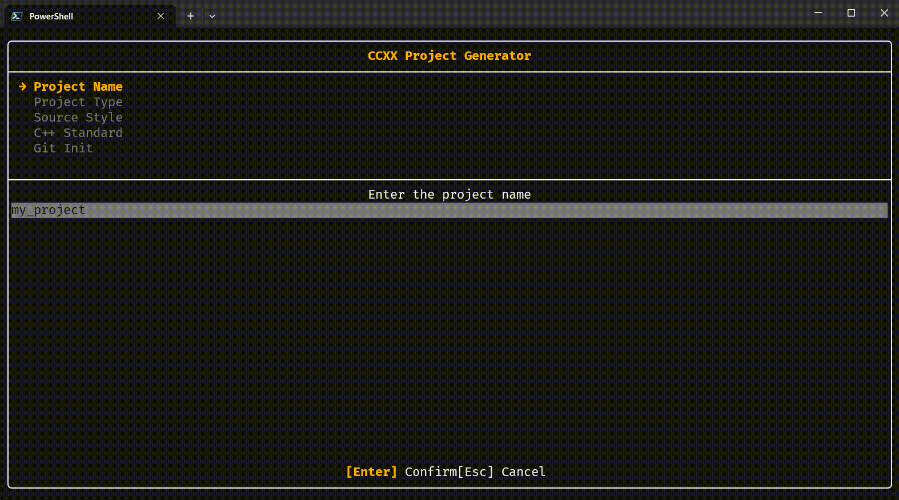

# ccxx &nbsp; &mdash; &nbsp; C++ project scaffold generator


**ccxx** generates ready-to-build C++ projects with sensible defaults — CMake,
clangd integration, and clang-format all wired up from the start. Use the
interactive TUI wizard to explore options, or skip straight to code with CLI
flags.

<picture>
  <source media="(prefers-color-scheme: dark)" srcset="assets/ccxx_tui_demo.gif">
  
</picture>

Supports executable and library projects across three source layouts:

- **Separate** &mdash; headers (`.hxx`) and sources (`.cxx`) side by side
- **Modules** &mdash; C++20 modules (`.ixx`) for cutting-edge compilation
- **Header-only** &mdash; single-header libraries (stb-style) with `IMPLEMENTATION` guard

---

## Quick start

```console
# Build ccxx
cmake -S . -B build
cmake --build build

# Launch the interactive wizard
./build/ccxx

# Or generate a project in one command
./build/ccxx myapp
cd myapp
cmake -S . -B build && cmake --build build
./build/myapp
```

---

## Features

- **Interactive wizard** &mdash; step-through TUI with keyboard navigation
- **CLI-first** &mdash; every wizard option is available as a flag for scripting
- **Three source styles** &mdash; separate, C++20 modules, or header-only
- **Strict tooling** &mdash; clangd with thorough clang-tidy checks,
  clang-format with Allman braces and 2-space indent
- **CMake 3.30** &mdash; modern CMake with generator expressions, install/export
  support, and `FILE_SET CXX_MODULES` for module projects
- **Compiler warnings** &mdash; per-target warning flags for MSVC, GCC, and Clang,
  with an opt-in `-Werror` / `/WX` mode
- **Git ready** &mdash; optional `git init` with `.gitignore`
- **Tests included** &mdash; every project type generates a `tests/` directory
  wired into CMake/CTest with a build option

---

## Usage

```
ccxx [options] [<project-name>]
ccxx .                              # use current directory as project root
ccxx                                # interactive setup wizard
```

### Options

| Option                      | Description                                           |
|-----------------------------|-------------------------------------------------------|
| `-n, --name <name>`         | Project name (or provide as positional argument)      |
| `-t, --type <type>`         | Project type: `exe`, `executable`, `lib`, `library`   |
| `-p, --path <dir>`          | Output directory (default: current directory)         |
| `-s, --std <num>`           | C++ standard: `20`, `23`, `26` (default: `23`)        |
| `-N, --namespace <name>`    | Namespace for library code (default: project name)    |
| `-S, --style <style>`       | Source style: `separate`, `module`, `header-only`     |
| `-g, --git`                 | Initialize git repository (branch: main)              |
| `-T, --tests <yes|no>`     | Generate test infrastructure (default: yes)           |
| `-f, --force`               | Overwrite existing project directory                  |
| `-h, --help`                | Show help message                                     |

Legacy type aliases (`static`, `static-lib`, `shared`, `shared-lib`,
`dynamic`) are accepted and map to `lib`. The legacy flag `--with` is
accepted as an alias for `--style`.

### Interactive wizard

Run `ccxx` without arguments to launch the TUI wizard.  It walks through each
option one step at a time:

| Step              | Control                    |
|-------------------|----------------------------|
| Project Name      | text input                 |
| Project Type      | executable / library       |
| Source Style      | separate / module or header-only |
| C++ Standard      | 20 / 23 / 26               |
| Git Init          | yes / no                   |
| Tests             | yes / no                   |
| Generate          | review and create          |

**Enter** confirms the current step; **Esc** goes back.  Esc on the first step
cancels entirely.

### Types and styles

The `--type` flag selects the project kind, and `--style` refines the source
layout within that kind.

| `--type`   | `--style`      | Result                                    |
|------------|----------------|-------------------------------------------|
| `exe`      | `separate`     | Executable with plain `.cxx` sources      |
| `exe`      | `module`       | Executable using C++20 modules (`.ixx`)   |
| `lib`      | `separate`     | Static library with `.hxx` / `.cxx`       |
| `lib`      | `header-only`  | Header-only library (stb-style)           |

---

## Examples

```console
# Default executable (C++23)
ccxx myapp

# Module-based executable
ccxx -n myapp --type exe --style module

# Static library with separate sources
ccxx -n mylib --type lib

# Header-only library (single header with IMPLEMENTATION guard)
ccxx -n mylib --type lib --style header-only

# Library with custom namespace
ccxx -n mylib --type lib --style header-only -N myns

# Executable without test infrastructure
ccxx -n myapp -T no

# Executable at a specific path with C++20 and git init
ccxx -n myapp --std 20 -g -p ~/projects

# Overwrite an existing project with all flags
ccxx -n myapp --type lib --style header-only -N xyz -s 20 -g -f
```

---

## Generated layouts

### Executable (`--type exe`, default style)

```
<project>/
├── CMakeLists.txt
├── cmake/
│   └── CompilerWarnings.cmake
├── .clangd
├── .clang-format
├── README.md
├── source/
    ├── defines.hxx
    ├── <namespace>/
    │   ├── <project>.hxx
    │   └── <project>.cxx
    └── main.cxx
├── tests/
    ├── CMakeLists.txt
    └── <project>/
        └── <project>.test.cxx
```

### Module executable (`--type exe --style module`)

```
<project>/
├── CMakeLists.txt
├── cmake/
│   └── CompilerWarnings.cmake
├── .clangd
├── .clang-format
├── README.md
├── source/
    ├── defines.ixx
    ├── main.cxx
    └── <project>.ixx
├── tests/
    ├── CMakeLists.txt
    └── <project>/
        └── <project>.test.cxx
```

### Library (`--type lib`, default style)

```
<project>/
├── CMakeLists.txt
├── cmake/
│   ├── CompilerWarnings.cmake
│   └── <project>Config.cmake.in
├── <project>/                  # subproject directory
│   ├── CMakeLists.txt
│   ├── <project>.cxx
│   └── include/
│       └── <namespace>/
│           ├── <project>.hxx
│           └── defines.hxx
├── tests/
│   ├── CMakeLists.txt
│   └── <project>/
│       └── <project>.test.cxx
├── .clangd
├── .clang-format
└── README.md
```

### Header-only library (`--type lib --style header-only`)

```
<project>/
├── CMakeLists.txt
├── .clangd
├── .clang-format
├── README.md
└── source/
    └── <namespace>/
        └── <project>.hxx
```

---

## Output details

Generated `CMakeLists.txt` files use `cmake_minimum_required(VERSION 3.30)`,
set `CMAKE_CXX_STANDARD` to the requested standard, and enable
`CMAKE_EXPORT_COMPILE_COMMANDS` for clangd integration.

All project types include a `cmake/CompilerWarnings.cmake` module that
provides sensible, compiler-agnostic warning flags per target. Tests can be
generated under `tests/` (opt out via `-T no`) and are gated behind a
`<PROJECT>_BUILD_TESTS` CMake option.

- **Executable** &mdash; library component (`lib<project>`) with thin
  `main()` wrapper; tests link against the library
- **Modules** &mdash; `target_sources()` with `FILE_SET CXX_MODULES PRIVATE`
- **Library** &mdash; modern subproject layout with `target_sources()`,
  `target_include_directories()` (build/install generator expressions),
  `CXX_STANDARD` via `set_target_properties()`, full install/export rules,
  and a CMake package config for `find_package()` consumers
- **Header-only** &mdash; `add_library(... INTERFACE ...)` with
  `target_include_directories(... INTERFACE source)`

The `.clangd` configuration includes strict clang-tidy checks that enforce:

- Allman brace style
- 2-space indentation  
- Left pointer alignment (`int* p`)
- Trailing return types

All projects include a `defines` header or module file that provides convenient
type aliases for primitive C++ types (`u8`, `s32`, `f64`, etc.).

If `--git` is provided, a `.gitignore` is generated and the repository is
initialized with `main` as the default branch.

---

## License

[MIT](LICENSE.txt)
